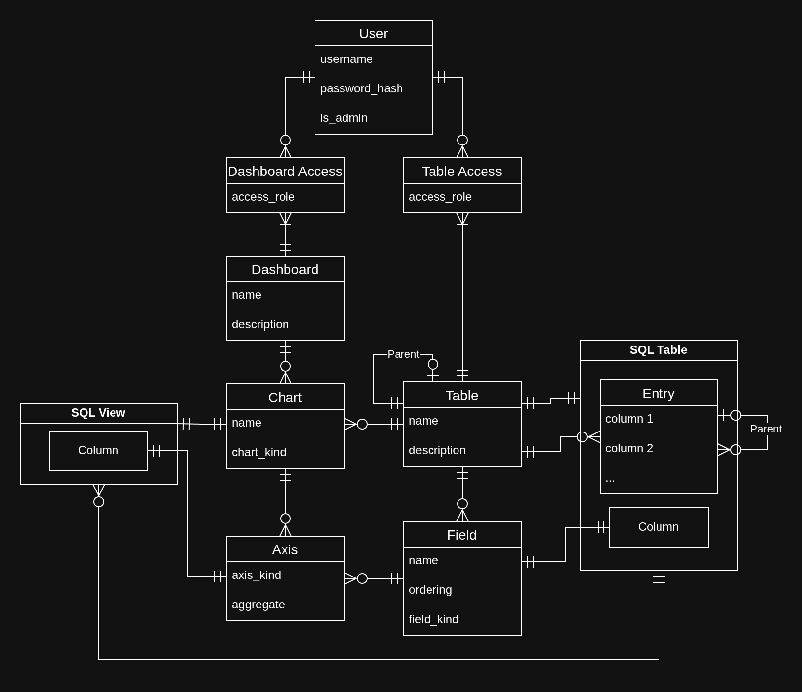

# Design

## High-Level Design
Chronicle uses a Standard [3-tier architecture](https://en.wikipedia.org/wiki/Multitier_architecture#Three-tier_architecture). The database is responsible for the persistence of user data. The backend interacts with the database and is responsible for implementing the buisness logic. The frontend interacts with the backend and is responsible for receiving user inputs and displaying user data.


### Key Features

#### Data management
The feature allows users to manage data in tabular format. Users can create tables, fields, and entries. Each field has a defined type, ensuring data integrity, and tables can easily be imported and exported in common file formats. Moreover, sub-tables can be created to represent a collection associated to a single entry.

##### Entites
- **Table**
  - Name
  - Description
  - Parent table (optional)

Represents the a table with all of its fields, entries, and child tables.

- **Field**
  - Name
  - Kind
  - Options

Represents a field or column in a table. Some extra option can be configured depending on the field kind.

- **Entry**
  - Cells

Represent a row in a table. The exact type of each cell depends on the table's fields.

**Operations**
- Create/Update/Delete for
  - Tables
  - Fields
  - Entries
- Get all user tables
- Get table fields
- Set table fields order
- Get table children
- Get a table and its fields, entries, and child tables
- Import a table from CSV or Excel
- Export a table to CSV or Excel

#### Data visualization
This feature allows users to create dashboards containing charts, which visualize data from user tables. Charts are composed of axes, which can represent the X and Y axis, labels, colors, and more. Axes can optionally be aggregates and use a table's field as a data source. The dashboard also allows users to resize and position the charts to create a visually appeallign dashboard.

##### Entites
- **Dashboard**
  - Name
  - Description

Represents the a dashboard which can contain multiple charts.

- **Chart**
  - Name
  - Kind

Represents a chart in a table with a specific chart kind.

- **Axis**
  - Kind
  - Aggregate (optional)

Represents an axis in a chart with a specific axis kind and can optionally have an aggregate function.

**Operations**
- Create/Update/Delete for
  - Dashboards
  - Charts
- Get all user dashboards
- Get dashboard charts
- Get a chart and its axes and data points
- Set a chart's axes

#### Access control and management
This feature allows users to share access their ressources with other users. Resources are either dashboards or tables, and they have three different access roles:
- Viewer: Can view all the content of the resource.
- Editor: Can perform create/update/delete operations on the resource's content.
- Owner: Can modify the resource's metadata, delete it, and manage access.

Each role has the same priviledges as all previous roles. The "content" of the resource refers to the table entries or the dashboard charts and axes.

##### Entities
- **Access**
  - Resource Reference
  - User Reference
  - Access Role

**Operations**

- Create/Update/Delete access
- Get all access for a resource

By default, resources created by users will grant them the Owner role. Each resource will have at least one owner.

#### User management
This feature is restricted to admin users. One such user is always present in the system. Admin can manage user accounts.

##### Entities
- **User**
  - Username
  - Password Hash
  - Admin Flag

Usernames are unique across the system. The password hash is used to verify user passwords without having to store them.

**Operations**

- Create/Update/Delete user
- Get all users

#### User authentication
This feature provides login/logout features for user sessions. Upon login, users receive a session cookie which is used on subsequent requests. This cookie expires after a certain time or upon logout.


### UI/UX 
One major part of fulfilling Chronicle's goal to make data analysis simpler is to make an easy-to-use interface. With that in mind, the top priority when designing the UI is to not overwhelm the user. To accomplish this, functionality is split across multiple screens each accessible by buttons in plain sight. Wherever feasible, type-specific input fields are used as passive input validation. 

DaisyUI was used as a framework to give the final product a more unified look. Colors are mostly neutral, with important buttons (e.g. cancel / delete buttons) in more vibrant colors to make them stand out. A generally "rounder" look is used in the designs to make the UI feel more inviting.

## Low-Level Design

### Backend
Chronicle's backend is a standard REST API made using the [Rust](https://www.rust-lang.org/) web framework [Axum](https://github.com/tokio-rs/axum). 

The backend code has the following file structure:

- `migrations/`: Database SQL schema
- `src/`: Application source code
  - `db/`: Database entity manipulation
  - `io/`: File imports and exports
  - `model/`: Model type definitions for responses, requests, and entities
  - `routes/`: Application router definition and route handlers
  - `main.rs`: Entry point of the application binary
  - `lib.rs`: Application configuration and router initialization
  - `auth.rs`: Authentication logic and configuration
  - `error.rs`: Custom Error type used accross the API
  - `docs.rs`: OpenAPI utilities and configuration
  - `test_util.rs`: Testing utilities
  - `<module>/data/`: Data management features
    - `tables.rs`: Tables holding user data
    - `fields.rs`: Fields within tables representing typed columns
    - `entries`: Entries within tables holding the user data in rows
  - `<module>/viz/`: Data visualization features
    - `dashboards`: Dashboard canvas of multiple charts
    - `charts.rs`: Charts visualizing data from user tables
    - `axes.rs`: Axes within a chart defining the data being visualized
  - `<module>/users.rs`: User management and login/logout
  - `<module>/access.rs`: User access control management
- `Cargo.toml`: Depedencies


The backend is seperated into four distinct module with different responsabilities.

`db` is responsible for all database queries and interactions. The module defines functions to manipulate and read from the database. 

All functions include the following in their signature:
- Database connection argument:
  - If the database is being modified:
    ```rust
    conn: impl Acquire<'_, Database = Postgres>,
    ```
  - Otherwise:
    ```rust
    executor: impl PgExecutor<'_>,
    ```
- Return type:
  ```rust
  sqlx::Result<*something*>
  ```

 `io` is responsible for import/export functions for user tables and charts. For imports, functions convert the data from a reader into a struct. For exports, functions take data from a struct and convert it to a writer.

`model` is responsible for defining the types modeling the database entites, responses, and requests. Responses and requests can be serialized to/deserialized from JSON using `serde_json`, and application entities map to database tables using `sqlx`.

`routes` is responsible for handling API requests and returning the appropriate response. Handles perform validation and gracefully handle user errors by returning the correct HTTP code. Routes follow the REST pattern. 

The request parameters is defined by the handler's function signature (extractor types):
- `AuthSession`: Get the currently logged in user. Returns error if user is not authenticated.
- `State<ApiState>`: Get the API database connection pool and configuration.
- `Path<...>`: Extract the path parameters.
- `Json<...>`: Extract the request JSON. Returns error on parsing failure.
- `Form<...>`: Extract the request form. Returns error on parsing failure.
- `Multipart`: Extract the request multipart. Used for passing files.

As for the return data:
- `ApiResult<Json<...>>`: Return JSON data or API error.
- `ApiResult<Vec<u8>>`: Return raw bytes or API error.

Documentation code and testing code is put into submodules named `docs` and `test` respectively inside each file.

#### Database

The application's database is a PostgreSQL instance.

Entity Relationship Diagram:



Our schema features some unusual relationships since some database objects are dynamically created. Table entities are associated with an actual SQL table, and field entites define its columns. As for charts

### Frontend
Chronicle makes use of [Svelte](https://svelte.dev/)+[SvelteKit](https://svelte.dev/docs/kit/introduction)'s modular component system for structure along with [Tailwind CSS](https://tailwindcss.com/) and [DaisyUI](https://daisyui.com/) for styling.

The front-end code has the following file structure:

- `static/`: Staticly served files
- `src/`: Application source code
  - `lib/`: Utility code
    - `api/`: API interaction
    - `components/`: Reusable Svelte UI components
    - `types/`; Model type definitions
  - `routes/`: Website URL routes
    - `login/`, `logout/`: User authentication pages
    - `(authGuarded)/`: Remaining pages, requires authentication
      - `tables/`: Data management views
        - `[table_id]/`: Table view
          - `edit/`: Field editing view
          - `subtables/`: Subtable views
      - `dashboards/`: Dashboard management views
        - `[dashboard_id]/`: Dashboard view
          - `charts/[chart_id]/edit/`: Chart editing view
      - `users/`: User management view
      - `+page.svelte`: Home page.
      - `+layout.svelte`: shared page layout
  - `app.html`, `app.css`, `app.d.ts`: Top-level Svelte application.
- `*`: Configuration files.

The basic layout of the source code has two main directories: `routes/`, where front-end code (i.e. HTML, CSS, JS/TS) is saved, and `lib/`, where shared application logic and utility code is saved.

Note that SvelteKit uses [filesystem-based routing](https://svelte.dev/docs/kit/routing), which means that the directory structure of the `routes/` directory correlates with the URL structure of the website. One exception to this rule is when directory names are placed within parentheses `()`, like `(authGuarded)`. Those directories are not included in the URL, but can be used to group together common routes as done here. Thus, the `.svelte` files in `routes/(authGuarded)/tables` will be rendered and served when a request for `https://[web-address]/tables` is made to the server.

Each route has a `+page.svelte` and an optional `+layout.svelte` file which Svelte uses to render a web-page. Files not prefixed with a `+` are route-specific components used to modularize the code.

The `lib/` folder structure does not influence SvelteKit's filesystem-based routing. It is instead organized by purpose. The `api/` folder provides an abstraction layer to make API requests, the `components/` folder holds shared svelte components, the `types/` folder holds TypeScript type definitions, and the `user.svelte.ts` file holds user-related logic. This code is used by webpages in the `routes/` directory. 

